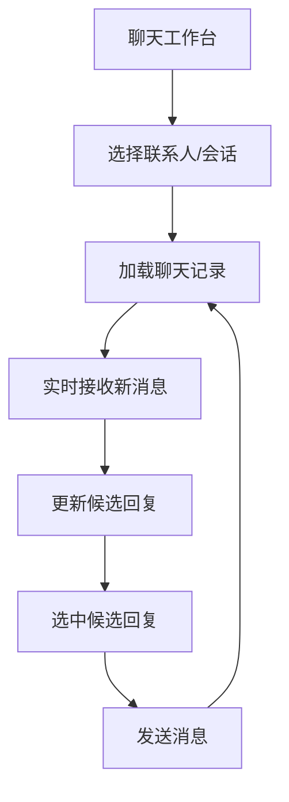

## 1. Product Overview
三栏聊天工作台前端：左侧联系人/会话列表，中间聊天记录（仿微信气泡），右侧候选回复列表。
通过对接现有后端 API，并支持实时更新（新消息、候选回复刷新），提升回复效率。

## 2. Core Features

### 2.1 Feature Module
本产品的核心页面如下：
1. **聊天工作台（首页）**：顶部状态栏、左侧联系人/会话列表、中间聊天记录与输入框、右侧候选回复区、实时连接状态。

### 2.2 Page Details
| Page Name | Module Name | Feature description |
|---|---|---|
| 聊天工作台 | 顶部状态栏 | 显示当前连接状态（在线/重连中/离线）、当前会话标题（联系人/群名）、基础操作入口（例如刷新）。 |
| 聊天工作台 | 左栏：联系人/会话列表 | 展示联系人或最近会话列表；支持搜索；显示未读数/最新一条消息摘要；点击切换会话并触发数据加载与订阅切换。 |
| 聊天工作台 | 中栏：聊天记录（仿微信） | 按时间顺序渲染消息气泡（自己/对方区分）、时间分隔；进入会话后加载最近消息；收到实时消息时增量追加并保持滚动体验（如在底部自动滚动，否则提示“有新消息”）。 |
| 聊天工作台 | 中栏：消息输入与发送 | 文本输入；发送按钮与回车发送；发送后在列表中回显（以“发送中/失败/已发送”状态体现后端回执）；支持点击右侧候选回复后填充输入框或一键发送。 |
| 聊天工作台 | 右栏：候选回复列表 | 在会话选中与新消息到达时，按后端能力拉取/推送候选回复；以卡片列表展示（可包含简短标签/理由，如后端有返回）；点击候选项执行“填入输入框”或“直接发送”。 |
| 聊天工作台 | 实时更新与错误处理 | 维护与后端的实时通道（WebSocket/SSE/长轮询择一适配）；断线自动重连与提示；关键 API 失败展示可恢复提示（重试/刷新）。 |

## 3. Core Process
1) 你进入聊天工作台后，前端先加载联系人/会话列表，并建立实时连接（如后端提供）。
2) 你点击某个联系人/会话：中栏拉取并展示聊天记录；同时切换该会话的实时订阅。
3) 当对方新消息到达：中栏实时追加消息；右栏同步刷新候选回复（由后端推送或前端触发拉取）。
4) 你在右栏点选候选回复：可自动填入输入框，确认后发送；或直接一键发送。
5) 发送成功后：中栏消息状态更新；必要时右栏再次刷新候选回复。

