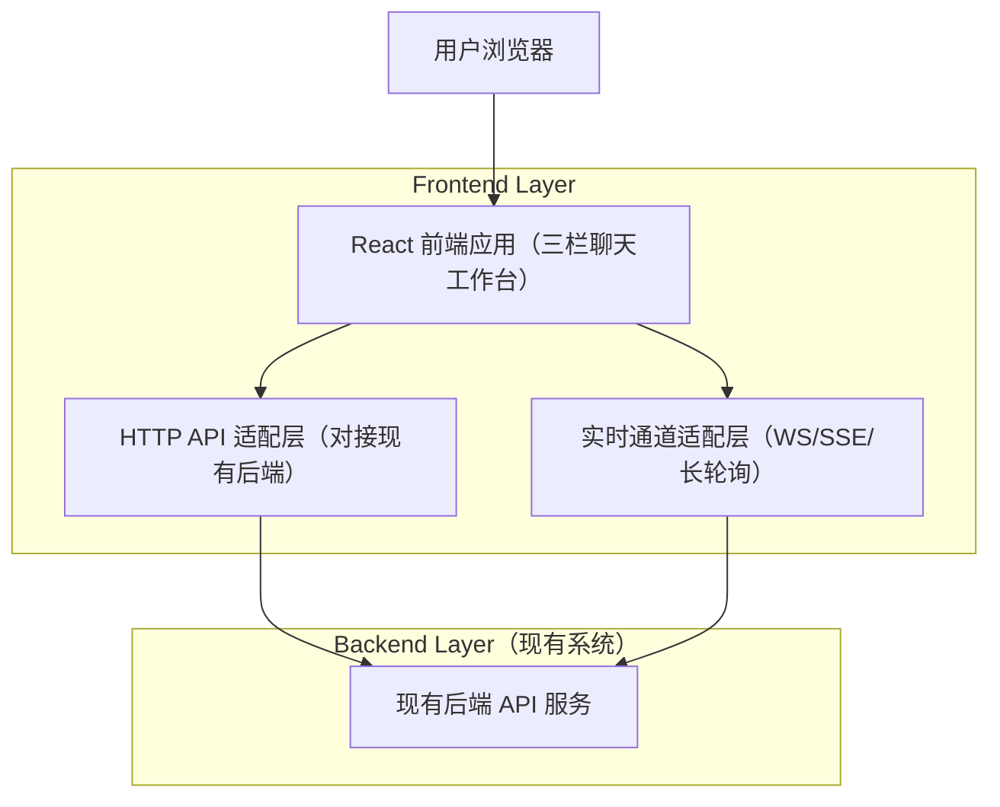

## 1.Architecture design


## 2.Technology Description
- Frontend: React@18 + TypeScript + vite + tailwindcss@3
- Backend: None（仅对接现有后端 API）
- Realtime: WebSocket（优先）；如现有后端仅提供 SSE/长轮询，则在“实时通道适配层”做同一接口封装
- State/Data: TanStack Query（用于请求缓存与刷新）+ 轻量本地状态（React Context 或 Zustand 二选一）

## 3.Route definitions
| Route | Purpose |
|---|---|
| / | 聊天工作台：三栏布局、会话切换、消息收发、候选回复展示与交互 |

## 4.API definitions (If it includes backend services)
本项目不新增后端服务；以下为前端“API 适配层”建议的统一 TypeScript 抽象（用于映射到你现有后端的真实路径/字段）。

### 4.1 Shared Types（建议）
```ts
export type Contact = {
  id: string;
  displayName: string;
  avatarUrl?: string;
  lastMessagePreview?: string;
  unreadCount?: number;
};

export type Message = {
  id: string;
  conversationId: string;
  sender: "self" | "peer";
  content: string;
  createdAt: string; // ISO
  status?: "sending" | "sent" | "failed";
};

export type CandidateReply = {
  id: string;
  conversationId: string;
  content: string;
  meta?: {
    label?: string; // 如后端提供：简短标签
    reason?: string; // 如后端提供：理由/意图
  };
  createdAt: string; // ISO
};
```

### 4.2 API Adapter Interface（建议）
```ts
export interface ChatApi {
  listContacts(): Promise<Contact[]>;
  listMessages(params: { conversationId: string; limit?: number; cursor?: string }): Promise<{ items: Message[]; nextCursor?: string }>;
  sendMessage(params: { conversationId: string; content: string }): Promise<{ message: Message }>;
  listCandidateReplies(params: { conversationId: string }): Promise<CandidateReply[]>;
}

export interface RealtimeAdapter {
  connect(): Promise<void>;
  disconnect(): void;

  subscribeConversation(
    conversationId: string,
    handlers: {
      onMessage?: (msg: Message) => void;
      onCandidates?: (items: CandidateReply[]) => void;
      onError?: (err: unknown) => void;
    }
  ): () => void; // unsubscribe
}
```

### 4.3 Real-time Event Mapping（对接点）
- 新消息：后端推送一条 `Message` 或等价 payload，前端增量追加到中栏。
- 候选回复：后端推送全量列表或增量项，前端刷新右栏。
- 回执：发送消息后若后端异步确认，需能更新 `Message.status`。

## 5.Server architecture diagram (If it includes backend services)
不适用（本项目不新增后端）。

## 6.Data model(if applicable)
不新增数据库；数据模型以“现有后端”为准，前端仅维护必要的展示态与缓存。
